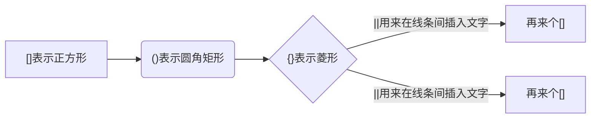

# MIT6.828
Mit 8.628 lab 

qemu : git clone https://github.com/mit-pdos/6.828-qemu.git

```mermaid
graph LR
rect["[]表示正方形"] -->roundedRect("()表示圆角矩形")
roundedRect --> condition{"{}表示菱形"}
condition -->|"||用来在线条间插入文字"| result1["再来个[]"]
condition -->|"||用来在线条间插入文字"| result2["再来个[]"]
```
